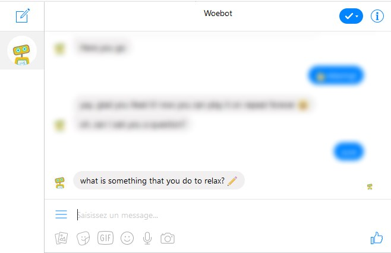
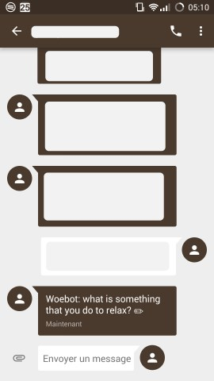

# SMSenger Bridge

## Example




## Prerequisites

- A Twilio account with a static 2-way SMS-enabled phone number (the Account SID and Auth token ready for you to use)
- A Facebook Messenger account

## Install instructions
I assume you know how to download/clone the repository.

First, create a virtualenv at the root of the project. (Optional)
```
cd /project/path/SMSenger-Bridge
virtualenv .
```

Activate the virtualenv (Optional)
```
./Scripts/activate
```

Install the requirements using pip
```
pip install -r requirements.txt
```

Duplicate the `.env.example` file and name it `.env`. Fill all the data in it with yours (see later section for more details)

Finally, run `main.py`
```
python main.py
```

## Setup
Once installed and running...

Open your port (5000 by default) in your firewall and add a port forward rule so it is accessible from the outside world

Then follow either the Twilio or Bandwidth setup steps (depending on the provider you chose):

### Twilio setup
1. Go to your twilio SMS webhook (Phone Numbers => Manage Numbers => Active Numbers => your purchased number)
1. Paste your IP:port/sms link (looks like http://155.73.2.44:5000/sms) in the "A MESSAGE COMES IN" field. Make sure the API is set to GET.

### Bandwidth setup
1. Go to your Bandwidth Application (Applications => [App name])
1. Paste your IP:port/bandwidth link (looks like http://155.73.2.44:5000/bandwidth) in the "Messaging callback URL" field. Make sure the Callback request method is set to GET.

## How to use
Once your sms provider is setup...

All the messages you are sent through facebook messenger will be sent to you via SMS (note that you pay PER SMS in many sms providers and PER NUMBER sometimes too)

If you want to talk to someone, send a message that looks like this: `@RECIPIENT NAME: Hello!`

The `@RECIPIENT NAME: ` part can be left out if you want to send a message to the same person many times in a row.

### .env file

| Environment variable | Description                                                                                                                                              |
|----------------------|----------------------------------------------------------------------------------------------------------------------------------------------------------|
| SMS_PROVIDER         | The third-party SMS provider you wish to use. Either 'twilio' or 'bandwidth' for the moment.                                                             |
| BANDWIDTH_USER       | Bandwidth User ID found in the account tab (use only if SMS_PROVIDER is set to bandwidth)                                                                |
| BANDWIDTH_TOKEN      | Bandwidth token found in the account tab (use only if SMS_PROVIDER is set to bandwidth)                                                                  |
| BANDWIDTH_SECRET     | Bandwidth secret found in the account tab (use only if SMS_PROVIDER is set to bandwidth)                                                                 |
| TWILIO_SID           | Twilio SID (use only if SMS_PROVIDER is set to twilio)                                                                                                   |
| TWILIO_AUTH_TOKEN    | Twilio Auth Token (use only if SMS_PROVIDER is set to twilio)                                                                                            |
| YOUR_NUMBER          | The phone number you want to chat with. Will be used to notify and to check for incoming SMS. Should be a "long code" (+18473920495)                     |
| MESSENGER_LOGIN      | Your facebook messenger login (usually an e-mail address)                                                                                                |
| MESSENGER_PASSWORD   | Your facebook messenger password                                                                                                                         |
| FLASK_HOST           | Set this to '0.0.0.0' in order to make your application public and respond to HTTP requests. You can also use ngrok instead of this. Optional parameter. |
| FLASK_PORT           | Port to use for hosting the web server. Optional parameter, will be 5000 if left out.                                                                    |

## Future of the project
For now, the next steps for the project are:

1. Add tests (medium priority)
2. Support group chat (very low priority)
3. Add a way to enable/disable automatically to save money on SMS usage (detect that you are connected/disconnected from elsewhere) (low priority)
4. Add a way to enable/disable manually to save money on SMS usage (with special SMS) (high priority)
